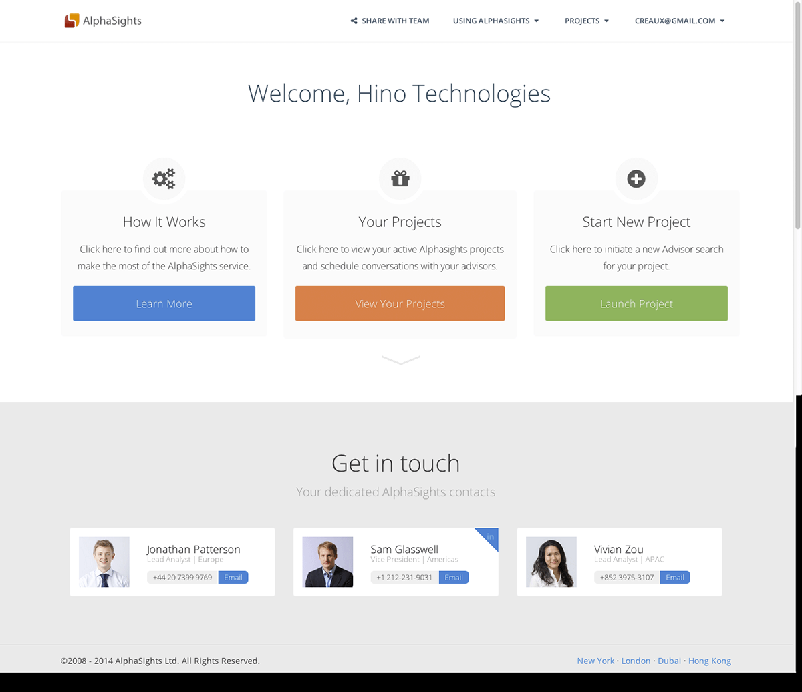
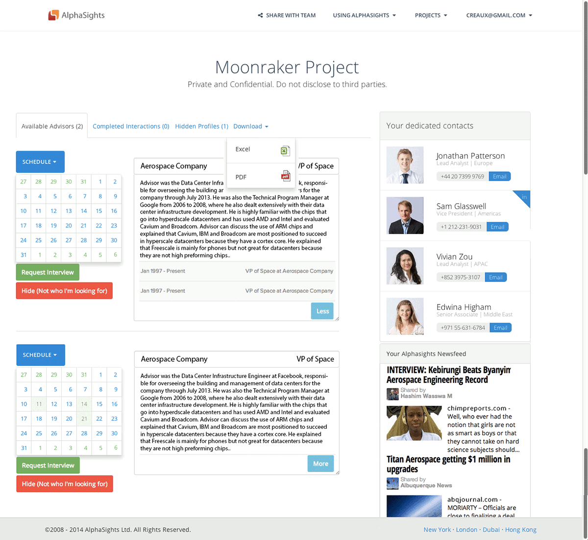

At Startup Institute, I worked on a small team consulting with one of Startup Institute's partner companies. Our project was to design an applet to simplify scheduling meetings.

Landing page:

Scheduling overview page:

UI elements from [2014 Material design](https://material.io)
