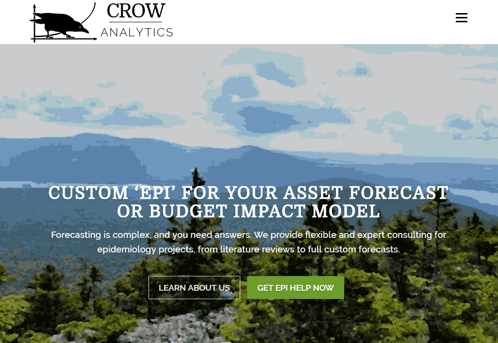
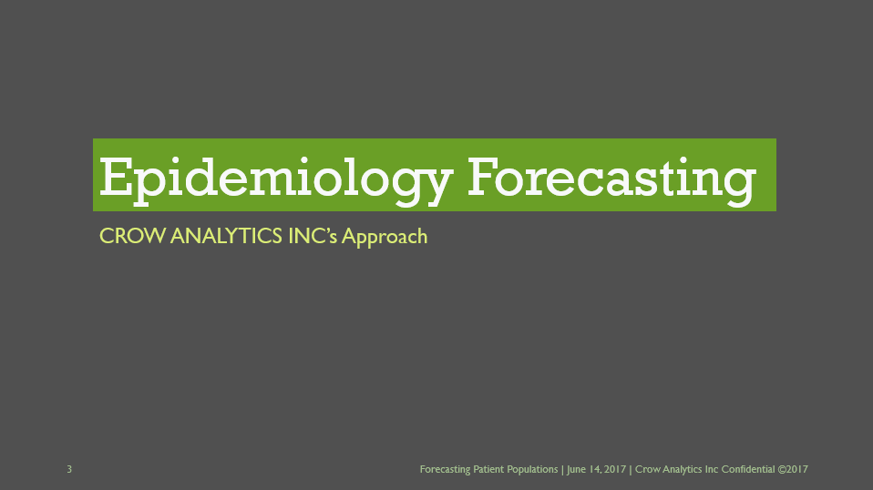
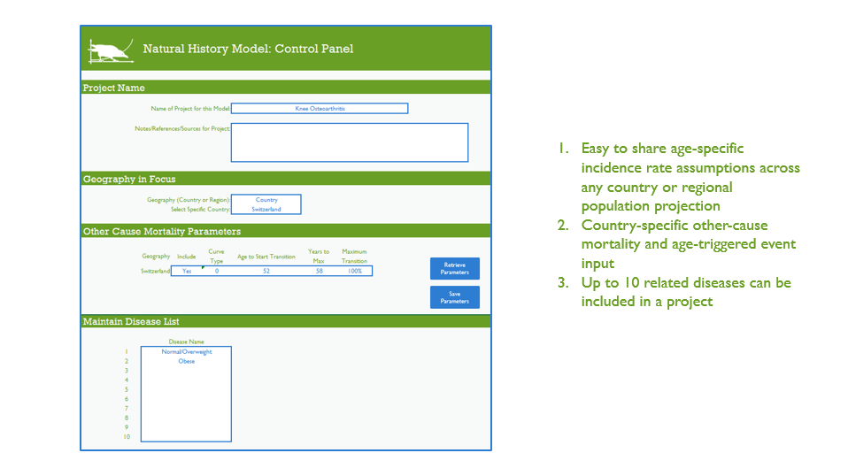

I was contracted to do complete branding for Crow Analytics, from logo and look-and-feel to website development.

The project also involved styling a highly technical and dense slide deck, and styling the client's proprietary excel workbook.

