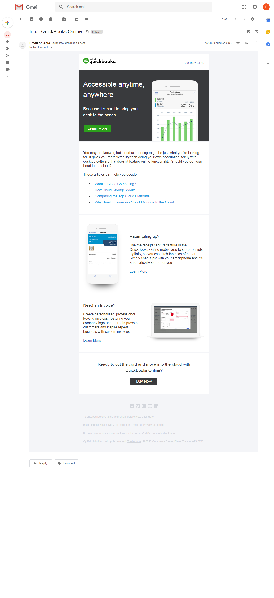
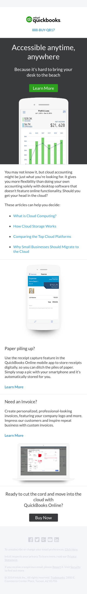
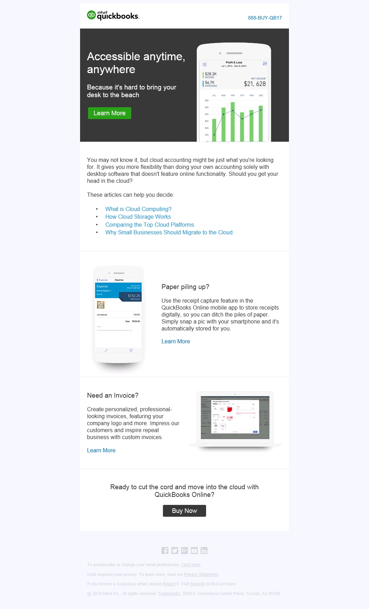

*Personal project!*

An html email template demonstration project using Intuit assets.

Here are screenshots from EmailOnAcid of full renders of the template for...

## Gmail in Chrome

## iPhoneX

## Outlook 2003

Don't ask me why EmailOnAcid delivered the Outlook screenshot as a .jpg rather than a .png!

Contact me if you are interested in seeing my HTML for this project.

Images copyright Intuit.
