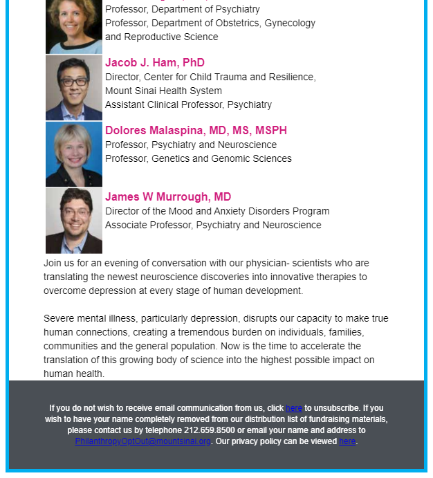

From 2015 to 2019, I supported the fundraising team at [Icahn School of Medicine at Mount Sinai](https://giving.mountsinai.org/site/SPageServer) by building and testing HTML email templates. I worked from PDF mockups. After the email was coded, I would verify functionality with EmailOnAcid. Then, I would upload the templates into their BlackBaud Luminate CMS, attach mailing lists, submit the prepared campaign for verification, and then send the email blasts.

In addition, I also updated their website through their CMS.

